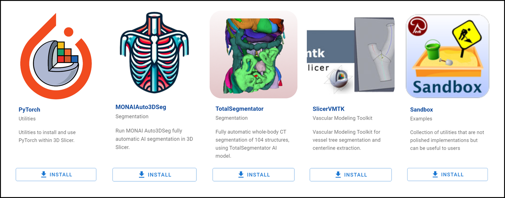
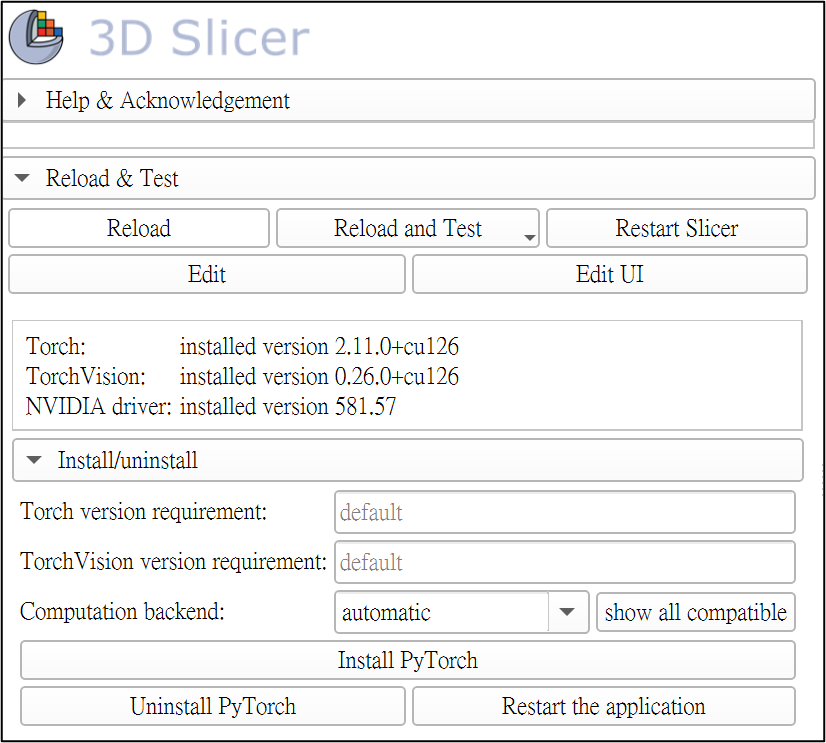
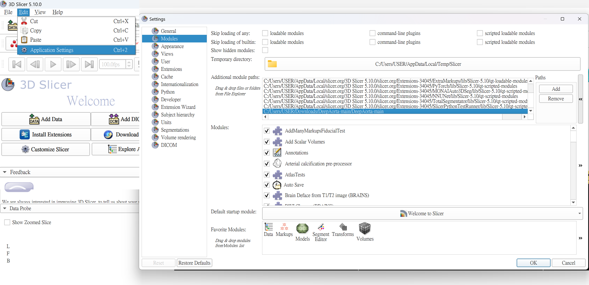

# Installation Guide

This guide will walk you through deploying and running the DeepAorta module in a fresh 3D Slicer environment.

*Read this in other languages: [繁體中文](README_zh-TW.md).*

## 1. System Requirements & Downloading Slicer
1. Download **Slicer 5.4 or newer** from the [official 3D Slicer website](https://download.slicer.org/).
2. Because DeepAorta relies on deep learning models (like TotalSegmentator), a dedicated graphics card (NVIDIA GPU with at least 8GB VRAM) is highly recommended for accelerated processing. CPU computation will be significantly slower.

## 2. Installing Required Extensions
DeepAorta requires several Slicer extensions to function properly.
1. Open 3D Slicer.
2. Click `View` -> `Extension Manager` in the top menu bar (or click the blue extension manager icon).
3. In the `Install Extensions` tab, search for and install the following extensions:
   - **TotalSegmentator** or **MONAIAuto3DSeg** (for initial aorta segmentation)
   - **SlicerVMTK** (Vascular Modeling Toolkit, for centerline extraction)
   - **Sandbox** (or search directly for **CurvedPlanarReformat** to ensure the vessel flattening tool is present)
   - **PyTorch** (Required for GPU acceleration of the deep learning models)

> [!TIP]
> 📸 **Extension Manager Screenshot**
>
> 

4. Once downloaded, please **Restart** 3D Slicer.
5. **(Important) Verify GPU Acceleration**: After Slicer restarts, open the **PyTorch Util** module (you can find it via the search bar <kbd>Ctrl</kbd>+<kbd>F</kbd>). Check if CUDA is listed as available. If not, click the button to install PyTorch with CUDA support and restart Slicer again. This ensures fast inference times.

> [!TIP]
> 📸 **PyTorch CUDA Verification**
>
> 

## 3. Loading the DeepAorta Module
Because DeepAorta is a third-party module, you must add its folder to Slicer's module paths:
1. Keep this project folder in a permanent local directory (e.g., extracted in your Documents).
2. Open 3D Slicer, and click `Edit` -> `Application Settings` in the top left.
3. Select the `Modules` tab on the left.
4. Locate the `Additional module paths` section, and click the `>>` (Add) button on the right.
5. Browse and select the `DeepAorta` folder inside this project (the folder containing `DeepAorta.py`).

> [!TIP]
> 📸 **Module Path Settings Screenshot**
>
> 

6. Click OK. Slicer will prompt you to restart to apply the new module paths.
7. Restart 3D Slicer.

## 4. Verifying Installation
After restarting:
1. Open the **Module Finder** by pressing <kbd>Ctrl</kbd>+<kbd>F</kbd>.
2. Search for and open the **DeepAorta** module.
3. If you see:
   - An `Input volume` selector
   - A `Model` dropdown (TotalSegmentator or MONAI-Aorta)
   - `Batch Inference` and `Apply` buttons at the bottom

**This means you have successfully installed and loaded the DeepAorta module!**

---
**Navigation:**
[🏠 Main Page](README.md) | [➡️ Next: Quickstart](QUICKSTART.md)
