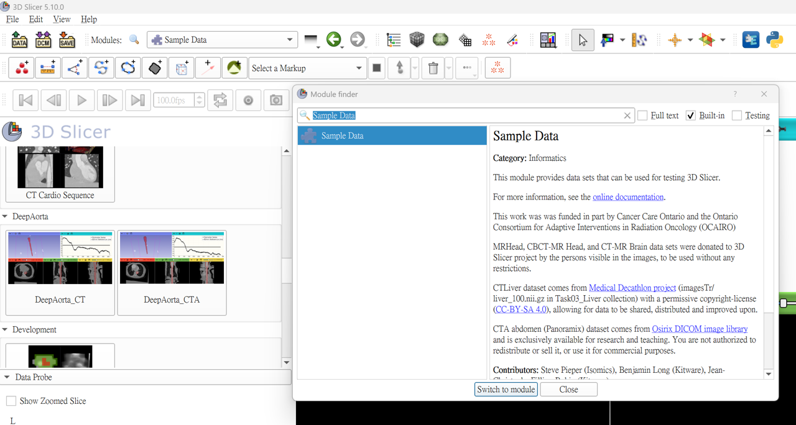
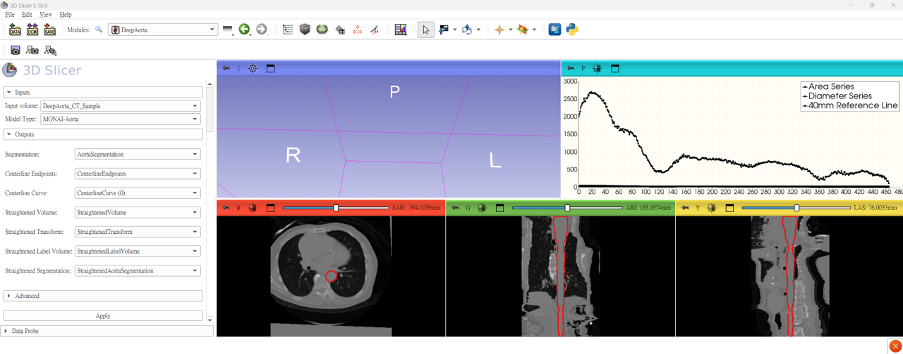

# Quickstart

If you have completed the setup steps in [INSTALL.md](./INSTALL.md), you can use the built-in Sample Data to quickly verify the entire DeepAorta analysis pipeline.

*Read this in other languages: [繁體中文](docs/zh-TW/QUICKSTART.md).*

## Step 1: Downloading Sample Data
1. Open 3D Slicer.
2. Open the **Module Finder** by pressing <kbd>Ctrl</kbd>+<kbd>F</kbd>.
3. Search for and open the **Sample Data** module.
4. Scroll down to find the **DeepAorta** category.
5. Click either **DeepAorta_CT** or **DeepAorta_CTA** once. The system will start downloading the test data in the background (please be patient, as 3D medical images can be large depending on internet speed).

> [!TIP]
> 📸 **Sample Data Module Screenshot**
>
> 

6. Once downloaded, the volume will automatically load into your 3D Slicer views.

## Step 2: Running the DeepAorta Module
1. Switch to the **DeepAorta** module (using the Module Finder <kbd>Ctrl</kbd>+<kbd>F</kbd>).
2. In the left configuration panel, verify:
   - **Input volume**: Ensure your downloaded image (e.g., `DeepAorta_CT_Sample`) is automatically selected. If not, manually select it.
   - **Model**: Select `TotalSegmentator` or `MONAI-Aorta` from the dropdown.
3. Click the **Apply** button at the bottom of the panel.

## Step 3: Viewing Results
This process will take a few minutes (involving segmentation, centerline extraction, curved planar reformatting, and quantitative statistics).
When finished, a dialog box will pop up saying "Operation completed successfully!". In the Slicer interface, you will see:
1. **Render Views**: The aorta has been straightened and flattened (`StraightenedVolume`), displayed with red outline labels.
2. **Statistical Plot**: A line chart is automatically drawn showing the cross-sectional area and diameter variations along the aorta's long axis, complete with a "40mm" dotted reference line.
3. **Data Table**: A table named `Aorta Statistics with Thresholds and AUC` is generated, housing clinically significant metrics such as maximum diameter (`Diameter_Max`).

> [!TIP]
> 📸 **Final Result Dashboard Screenshot**
>
> 

---
**Navigation:**
[⬅️ Previous: Installation](INSTALL.md) | [🏠 Main Page](README.md) | [➡️ Next: Workflow Tutorial](WORKFLOW_TUTORIAL.md)
