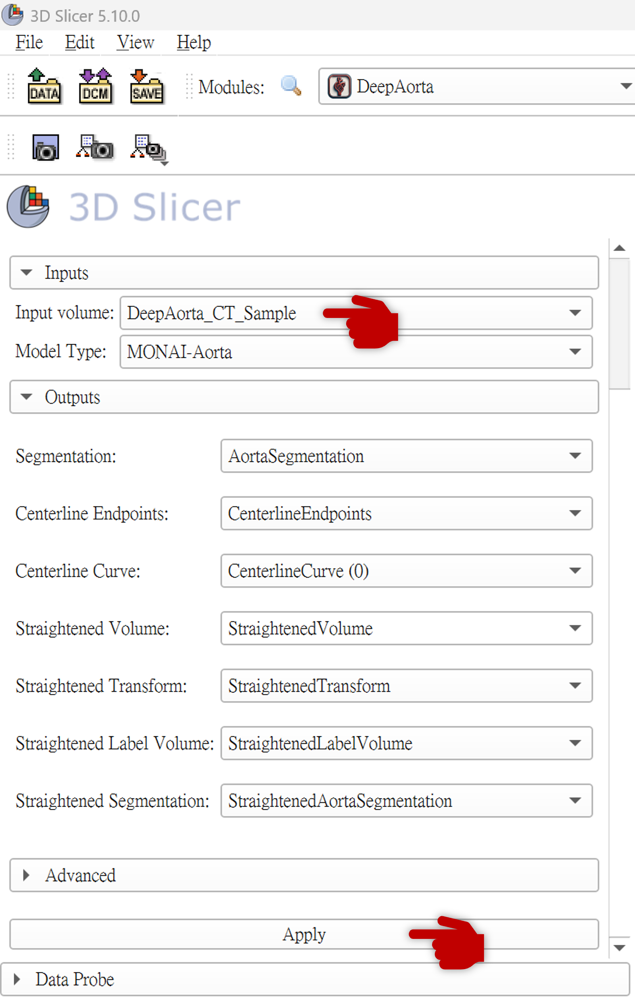

# 完整操作教學 (Workflow Tutorial)

DeepAorta 模組專作於從腹部或胸部 CT 影像自動化分割並量化主動脈。它支援**單例模式**與**批次處理模式**。

## 1. 介面欄位介紹
* **Input volume**: 選擇已經匯入至 3D Slicer 並且想要分析的 3D CT 影像 (例如 `.nii.gz`, `.nrrd`, 或者是載入的 DICOM Volume)。
* **Model**: 提供兩種主動脈初步分割骨幹:
  1. `TotalSegmentator`: 準確率高但稍微更需要記憶體。
  2. `MONAI-Aorta`: 基於 MONAIAuto3DSeg，輕量且專精於 `aorta-v1.1.0` 模型。

## 2. 單例影像分析 (Single Inference)
若您只有一兩名病患的資料或需要仔細檢視每個步驟：
1. 匯入影像進 3D Slicer (例如直接拖曳 `.nii.gz` 到視窗內並選擇 `Volume`)。
2. 開啟 **DeepAorta** 模組。
3. 設定 Input volume 為您的掃描影像。

> [!TIP]
> 📸 **DeepAorta 操作介面截圖**
>
> 

4. 按下 **Apply**。
5. 模組會自動執行以下流程：
   - **模型前推**: 呼叫 TotalSegmentator 切割出帶有 `AortaSegmentation` 名字之範圍。
   - **萃取中心線 (Centerline)**: 透過 VMTK 找出主動脈首端到尾端最遠點，連成曲線。
   - **血管拉直 (Straightening)**: 沿著上一步的中心線曲面進行影像拉直展平 (`CurvedPlanarReformat`)，產生獨立的 `StraightenedVolume` 節點。
   - **幾何平滑與計算**: 進行凸包抓取並在每個軸向切片上求面積及最大直徑。
   - **生成對比報表**: 一份圖表 (ChartView) 及一份表單 (TableViewNode)。

## 3. 批次處理分析 (Batch Inference Mode)
當您需要一次跑過許多病患 (例如十幾個存放好的 DICOM Folder) 並進行量化時：
1. 請準備一個專為該批次建立的根目錄 (例如：`C:\MyDataset\AAA_Cases\`)。
2. 該目錄下一層必須是各別病患資料的目錄（每個目錄下放該病患的 DICOM `.dcm` 檔案群）。
   ```text
   AAA_Cases/
    ├─ Patient_001/
    │   ├─ 001.dcm, 002.dcm ...
    ├─ Patient_002/
    │   └─ ...
   ```
3. 打開 Slicer 並進入 DeepAorta 模組。
4. 找到 **Batch Inference Directory** 欄位，點擊資料夾圖示，並選擇您的 `AAA_Cases` 資料夾。
5. 點擊 **Batch Inference 按鈕**。
6. 由於批次模式需要載入多個 DICOM 實體，Slicer 將自動建立一個虛擬 DICOM Database，解析每一筆後自動載入分析並存檔，存檔完畢後**清除當前畫面場景**。
7. 成果輸出: 整個跑完後，您可以在 `C:\MyDataset\` 底下找到系統自動新增的資料夾 `AAA_Cases_AortaQuanBatchResult`。裡面會有每個案子處理完生成的包含所有計算表單的 `.mrb` 壓縮專案檔，可以直接拖回 Slicer 檢視。


## 4. 防呆建議與驗收提示
* 在 Batch 模式中，不要移動滑鼠或進行額外點擊，這可能導致執行緒凍結或報錯崩潰。
* 出錯的案件會在執行完畢後統一保存在存檔路徑下的 `log.txt` 中，記載了哪筆資料失敗以供反查。
* 如果畫面出現 `EmptyLabelMap` 或拉直影像消失，請確認您選擇的模型 (TotalSegmentator) 是否有因為系統資源不足被 Kill 掉（常見於內建記憶體小於 16GB 的電腦）。

---
**導覽 (Navigation):**
[⬅️ 上一步: 快速上手](QUICKSTART.md) | [🏠 回首頁](../../README_zh-TW.md) | [➡️ 下一步: 錯誤排除](TROUBLESHOOTING.md)
